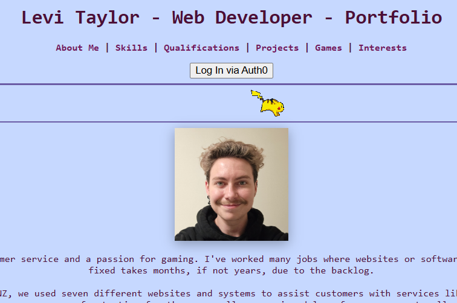

# Levi Taylor - Web Developer Portfolio

A personal web developer portfolio built with **React**, **TypeScript**, and **Vite**, featuring a retro-inspired custom styling aesthetic, smooth client-side routing, and integrated authentication.

🔗 **Live Site:** [Render Deployment](https://portfolio-d4vk.onrender.com)

---

## Features

* **Custom Color Palette:** Styled using a cohesive 5-color palette (`#C6D8FF`, `#71A9F7`, `#6B5CA5`, `#72195A`, `#4C1036`) featuring custom vertical gradients and high-contrast text styling.
* **Dynamic Qualification & Project Cards:** Structured cards displaying professional achievements, education (Dev Academy, Yoobee College, MITO), and deployed coding projects with embedded badges and logos.
* **Client-Side Routing:** Fast, seamless navigation across views without full page reloads.
* **Auth0 Integration:** Secure authentication workflow via `@auth0/auth0-react` showcasing login/logout states.
* **Fun Animations:** Custom animated pixel-art track elements.

---

## Tech Stack

* **Frontend:** React, TypeScript, Vite
* **Styling:** Custom CSS (Modular layout, flexbox, gradients, filters)
* **Authentication:** Auth0 (`@auth0/auth0-react`)
* **Package Manager:** pnpm
* **Deployment:** Render (Static Site with SPA routing rewrites)

---

## Getting Started Locally

To run this project on your local machine, make sure you have `Node.js` and `pnpm` installed:

`git clone [https://github.com/Levi-Taylor-Hotoke-26/portfolio.git]`

`cd portfolio`

`cd client`

`pnpm install`

`cd ..`

`pnpm run dev`

Open your browser and navigate to `http://localhost:5173`.

## Auth0 Setup (Optional for Local Dev)
To test the Auth0 login flow locally:

1. Create a free account with `Auth0`
2. From your Auth0 dashboard, create a new `Single Page Application`
3. Add `http://localhost:5173` to your `Allowed Callback URLs`, `Allowed Logout URLs`, and `Allowed Web Origins`.
4. Pass your `Auth0` `domain` and `clientId` into the `<Auth0Provider>` inside `client/src/index.tsx`.

## Author
* Levi Taylor - Web Developer
* GitHub: @Levi-Taylor-Hotoke-26